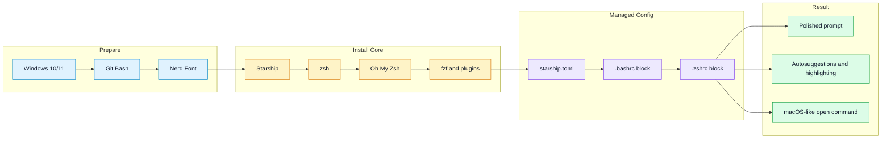

# windows-bash-zsh

English | [简体中文](README.md)

Quickly configure a Git Bash terminal environment on Windows, including Zsh, Oh My Zsh, the Starship prompt, and common plugins.

## Features

- **Starship prompt**: Catppuccin Mocha color palette and a polished shell prompt.
- **Zsh + Oh My Zsh**: A powerful shell framework and plugin ecosystem.
- **Common plugins**: Autosuggestions, syntax highlighting, fzf fuzzy search, and more.
- **open command**: Adds a macOS-like `open` helper for Windows.
- **Guided setup**: Follow `SKILL.md` and the referenced workflow to complete the configuration.

## Quick Start

Read [SKILL.md](SKILL.md) to understand when the skill should trigger and how it works.

Detailed setup, update, rollback, and troubleshooting steps are in [references/setup-workflow.md](references/setup-workflow.md).
Reusable configuration templates are in [assets](assets/):

- `starship.toml`: Starship theme configuration.
- `bashrc-block.sh`: Managed `.bashrc` block for idempotent updates.
- `zshrc-block.zsh`: Managed `.zshrc` block for idempotent updates.

## Workflow Diagram

## Requirements

- Windows 10/11
- Git for Windows, including Git Bash
- Python 3 for extracting the zsh package
- Administrator permission for copying zsh files into the Git installation directory

## Screenshot

## Star History

