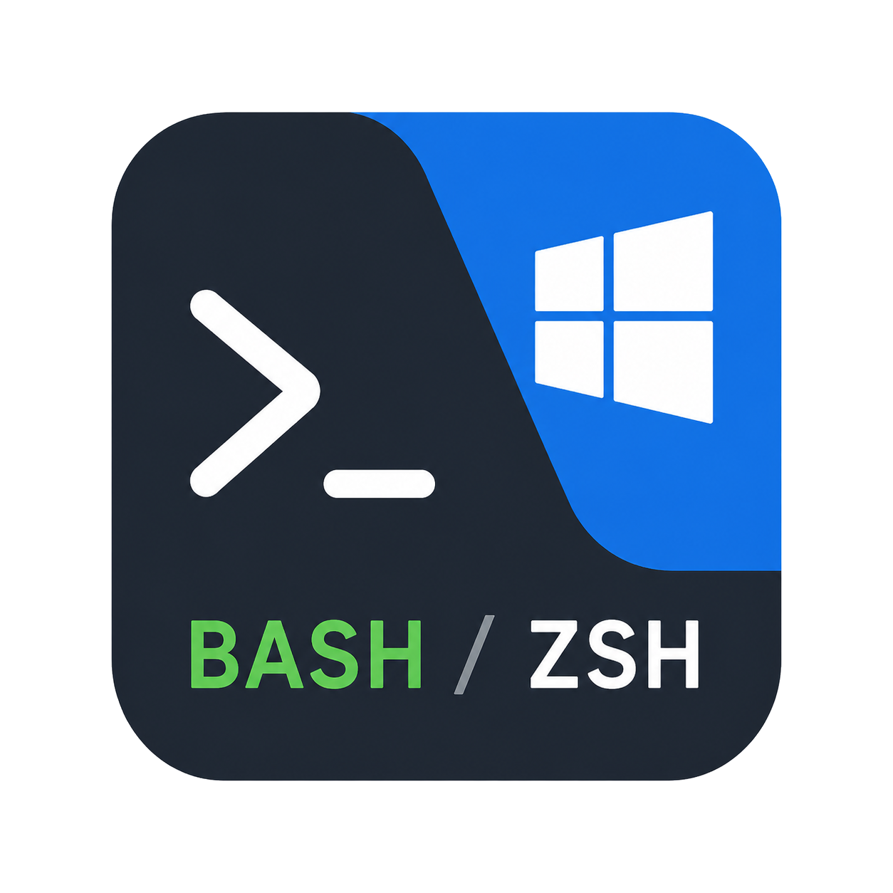

# windows-bash-zsh

<p align="center">
  
</p>

<p align="center">
  English | <a href="README-ZH.md">简体中文</a>
</p>

Turn Git Bash on Windows into a zsh terminal environment close to the macOS/Linux experience: Windows Terminal, Oh My Zsh, Starship, fzf, common zsh plugins, and modern CLI tools such as bat, ripgrep, lsd, and yazi.

## Screenshot


## Video

<p align="center">
  <video src="video.mp4" poster="screenshot.png" controls width="100%"></video>
</p>

[Open video](video.mp4)

## Quick Start

### Download or clone this project to your computer

```shell
git clone https://github.com/gyf-dev/windows-bash-zsh.git
```

### Install

PowerShell:

```powershell
powershell.exe -ExecutionPolicy Bypass -File .\install.ps1
```

CMD:

```cmd
install.cmd
```

`install.cmd` prefers `install.ps1` in the same directory. If neither `powershell.exe` nor `pwsh.exe` is available, it automatically falls back to a pure CMD install/uninstall path.

Bash:

```shell
bash install.sh
```

Default targets:

- Codex: `~\.codex\skills\windows-bash-zsh`
- Claude: `~\.claude\skills\windows-bash-zsh`
- Agents: `~\.agents\skills\windows-bash-zsh`
- Copilot: `~\.copilot\skills\windows-bash-zsh`

>**Then enable this Skill in the corresponding Agent platform, run `windows-bash-zsh`, and reopen your terminal to experience zsh in Git Bash.**

### Uninstall

PowerShell:

```powershell
powershell.exe -ExecutionPolicy Bypass -File .\install.ps1 -Uninstall
```

CMD:

```cmd
install.cmd -Uninstall
```

Bash:

```shell
bash install.sh --uninstall
```

### Other

PowerShell:

```powershell
# Install only to a target, for example Codex
powershell.exe -ExecutionPolicy Bypass -File .\install.ps1 -Targets codex

# Uninstall only from Copilot
powershell.exe -ExecutionPolicy Bypass -File .\install.ps1 -Targets copilot -Uninstall

# Also install to a custom skills directory
powershell.exe -ExecutionPolicy Bypass -File .\install.ps1 -ExtraSkillRoots "D:\MyAgent\skills"
```

CMD:

```cmd
# Install only to a target, for example Codex
install.cmd -Targets codex

# Uninstall only from Copilot
install.cmd -Targets copilot -Uninstall

# Also install to a custom skills directory
install.cmd -ExtraSkillRoots "D:\MyAgent\skills"
```

Bash:

```shell
# Install only to a target, for example Codex
bash install.sh --targets codex

# Uninstall only from Copilot
bash install.sh --targets copilot --uninstall

# Also install to a custom skills directory
bash install.sh --extra-skill-roots "D:/MyAgent/skills"
```

`-ExtraSkillRoots` is an explicit target; during installation, the script creates it when it does not exist. If the same Skill already exists, the script asks whether to replace it; press Enter or enter `y` to overwrite, and enter `n` to skip. During uninstall, only the `windows-bash-zsh` directory under the target root is removed; the skills root is kept.

## Features

- **Windows Terminal integration**: Add a Git Bash profile, configure the default terminal, font, and common shortcuts.
- **Zsh + Oh My Zsh**: Install and enable zsh, Oh My Zsh, and common plugins inside Git Bash.
- **Starship prompt**: Use a Catppuccin Mocha style prompt configuration.
- **Modern CLI tools**: Integrate bat, ripgrep, lsd, yazi, plus yazi preview dependencies: 7-Zip, ImageMagick, and FFmpeg.
- **macOS-like open**: Provide a macOS-like `open` command on Windows.
- **Idempotent configuration**: Fill in missing configuration only; do not overwrite `.bashrc`, `.zshrc`, Windows Terminal, or VS Code settings.

## Requirements

- Windows 10/11
- Git for Windows, including Git Bash
- Windows Terminal: usually bundled with Windows 11; Windows 10 users can install it from [Microsoft Terminal Releases](https://github.com/microsoft/terminal/releases/)
- PowerShell: Windows PowerShell 5.1 is enough; PowerShell 7 is optional
- Windows Package Manager, winget, for installing Starship and CLI tools
- Python 3 for safely extracting the zsh package
- Administrator permission for copying zsh files into the Git installation directory

## Workflow Diagram


## Star History

[](https://www.star-history.com/#gyf-dev/windows-bash-zsh&type=date&legend=top-left)
