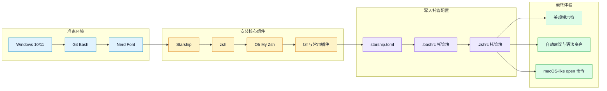

# windows-bash-zsh

[English](README-EN.md) | 简体中文

为 Windows 快速配置 Git Bash 终端环境，包括 Zsh、Oh My Zsh、Starship 主题和常用插件。

## 功能特性

- **Starship 主题** - Catppuccin Mocha 配色，美观的命令行提示符
- **Zsh + Oh My Zsh** - 强大的 Shell 框架和插件管理
- **常用插件** - 自动建议、语法高亮、fzf 模糊搜索等
- **open 命令** - 在 Windows 上提供类似 macOS 的 `open` 命令
- **一键配置** - 按照 SKILL.md 步骤操作即可完成配置

## 快速开始

查看 [SKILL.md](SKILL.md) 了解技能的触发场景和执行流程。

详细安装、更新、回退和排障步骤在 [references/setup-workflow.md](references/setup-workflow.md)。
可复用配置模板在 [assets](assets/) 目录：

- `starship.toml`：Starship 主题配置
- `bashrc-block.sh`：可幂等写入 `.bashrc` 的托管配置块
- `zshrc-block.zsh`：可幂等写入 `.zshrc` 的托管配置块

## 流程示意图

## 环境要求

- Windows 10/11
- Git for Windows（Git Bash）
- Python 3（用于解压 zsh 包）
- 管理员权限（用于复制 zsh 文件到 Git 目录）

## 效果图

## Star History

